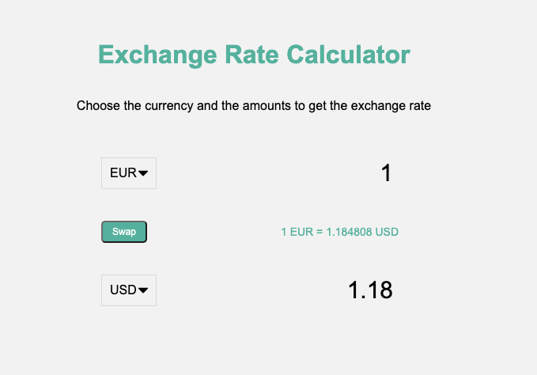

## Exchange Rate

Select countries to get the exchange rate for a specific amount

## Project Specifications

- Display UI with 2 select lists for countries and 2 inputs for amounts
- Fetch exchange rates from API (https://api.exchangerate-api.com)
- Display the values for both countries
- Update values on amount change
- Swap country rates

### Running
* clone this repo
* npm init, install dependencies
* npm start
* go to local host

### Exchange Rate
[View Live here](https://xinyutang-calculator.herokuapp.com/)

### In-app Screens

