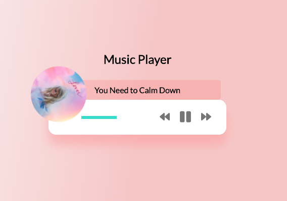
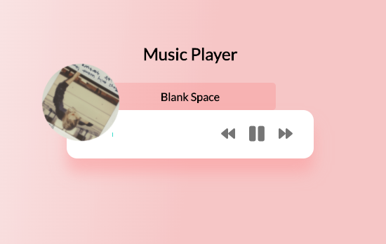

## Music Player

Create beautiful UI to play music stored in the "music folder" using the HTML5 audio API

## Project Specifications

- Create UI for music player including spinning image and song detail popup
- Add play and pause functionality
- Switch songs
- Progress bar

### Running
* clone this repo
* npm init, install dependencies
* npm start
* go to local host

### Search Reddit
[View Live here](https://xinyutang-musicplayer.herokuapp.com/)

### In-app Screens

